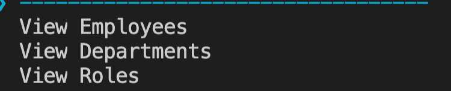
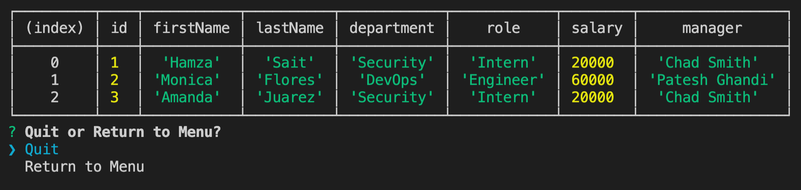
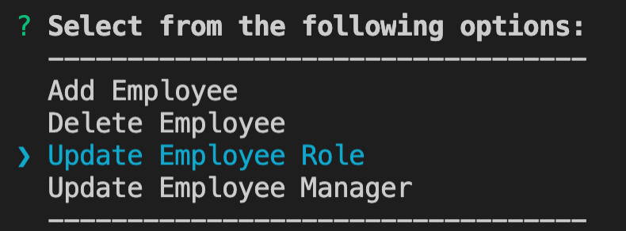
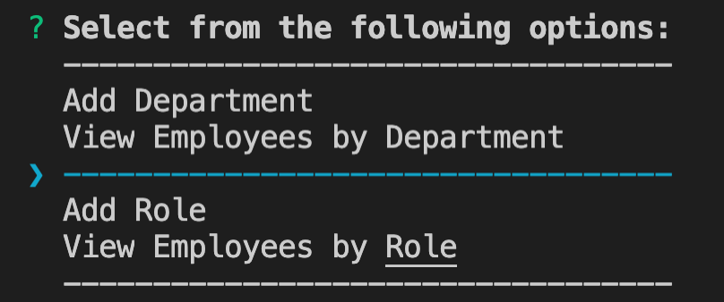

# Employee Tracker

This week's assignment was to build an employee tracker that could be used in the terminal. This employee tracker connects to an SQL database hosted locally on your machine.

### 1. Getting Started

The first thing you will need to do is run the seedConstructor.sql file and the seedData.sql file in a MySQL terminal or MySQL workbench. 

Next, download the dependencies required for the employee tracker. To download these run the following command: 

    npm i

Once the download is complete you may now run the following command to start the program.

    npm start

### 2. Viewing

The first section of the employee tracker is viewing. You can view Employees, Roles, and Departments.

If you select any of these options, a table will print to the console with relevant information.

### 3. Employee Menu

The second section of the employee tracker is the employee menu. In this section we can add, remove or edit the department or role of an employee.

### 4. Department and Role menu

The third and fourth section of the employee tracker are the department and role menus. Here we can add departments and roles or view employees by department or role. 

